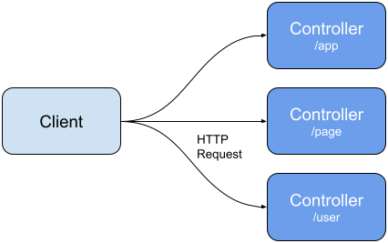

# Peque.ts

This framework is built on-top of **Express** and is intended to provide a **standard** to help the **design**, **development**,
and **life-cycle management** of **scalable** and **efficient** server-side web application (with **Node.js**).
It can also be used to **invert the control** in a pre-existent Express application.

## <a name="toc">Table of contents
- [Install](#install)
- [General architecture](#architecture)
- [Modules](#modules)
- [Controllers](#controllers)
  - [Routings](#controllers-routings)
  - [Middlewares](#controllers-middlewares)
- [Providers](#providers)
  - [Dependency injection](#providers-di)
  - [Custom providers](#providers-custom)
- [Build-in features](#builtin-features)

## <a name="install"></a>Install
`npm i peque.ts`

## <a name="architecture"></a>General architecture


## <a name="modules">Modules
The modules are classes with the necessary metadata in order to define the structure of the application.
They can import other modules and define its controller.
An application must have at least one root module (a module importing all the other modules).


The Modules are decorated with the `@Module()` decorator that is necessary to define its metadata (other modules or controllers).
```typescript
@Module({
  modules: [RandomModule],
  controllers: [TestController],
  providers: [
    HttpService,
    ExternalTestService,
    TestRootService
  ]
})
export class TestRootModule { }
```

## <a name="controllers"></a>Controllers
The controllers are the components designated to handle the incoming **requests** and to return **responses** to the client.



### <a name="controllers-routings">Routings
The `@Controller()` decorator is required together with the route argument (`/test`) in order to define a controller.
The `@Get()` decorator is the handler for a specific endpoint of the controller. Its argument is defining the final route `/test/hellow-world`
```typescript
@Controller('/test')
export class TestController {
  constructor() {
  }
  
  @Get('/hello-world')
  async helloWorld() {
    return { test: 'hello world' };
  }
}
```

Of course, the framework give access to all the standard methods as well:
- `@Get()`
- `@Post()`
- `@Put()`
- `@Patch()`
- `@Delete()`

Decorators to intercept directly the content of the **response** and the **request** are available:

| Decorator               | Description                          |
|-------------------------|--------------------------------------|
| `@Request()`            | The entire `express.Request` object  |
| `@Response()`           | The entire `express.Response` object |
| `@Param(key?: string)`  | `req.params` or `req.params[key]`    | 
| `@Query(key?: string)`  | `req.params` or `req.query[key]`     |
| `@Header(key?: string)` | `req.headers` or `req.headers[key]`  |
| `@Body()`               | `req.body`                           |
| `@Session()`            | `req.session`                        |

### <a name="controllers-middlewares">Middlewares
Middlewares can be injected as **single** or **array** at controller time or HTTP method time.
They are always called **before** the endpoint handler.


The middlewares placed at Controller time are applied for **all the routes** that belongs to the controller itself:
- `@Controller('/path', middlewareFunction)`
The middlewares placed at HTTP method time are applied for the **single route**:
- `@Get('/endpoint', [functionOne, functionTwo])`

```typescript
@Controller('/test', middlewareFunction)
export class TestController {
  constructor() {
  }
  
  @Get('/hello-world', [functionOne, functionTwo])
  async helloWorld() {
    return { test: 'hello world' };
  }
}
```

## <a name="providers">Providers
A provider **injects** dependencies establishing relationships within objects.
Most of the classes inside a project can be handled as providers, like: services, factories, repositories, and like.


### <a name="providers-di">Dependency injection
The framework leverages the **dependency injection** pattern.
It makes classes injectable by using the decorator `@Injectable()` and injects them with the decorator `@Inject()` or directly in the constructor without the `@Inject()` decorator, but just the Provider class typing.
```typescript
@Injectable()
export class ExternalTestService {
  constructor(private readonly httpService: HttpService) {
  }

  async getExternalCall() {
    const httpTest = await this.httpService.get({
      query: {
        param1: 'externaTest',
        param2: 12345
      },
      url: 'https://httpbin.org/get',
    });
    return { test: 'hello world', result: httpTest };
  }
}
```

The providers are finally resolved by the framework and returned as **singletons**, means returning the **existing instance** (if it has already been requested elsewhere) in the **property** that has been decorated with `@Inject()`.
```typescript
@Controller('/test')
export class TestController {
  constructor(private readonly externalService: ExternalTestService) {
  }
  
  @Get('/hello-world')
  async helloWorld() {
    return { test: 'hello world' };
  }
  
  @Get('/external')
  async external() {
    return { external: this.externalService.getExternalCall() };
  }
}
```

### <a name="providers-custom">Custom providers
The providers can also be custom in the case we want to cover it with an abstract class and inject it with different implementations.
The `providers` metadata in `@Module()` can either be a specific provider or a custom mapping.

```typescript
@Module({
  modules: [RandomModule],
  controllers: [TestController],
  providers: [
    { provider: CacheManager, useClass: RedisService }
  ]
})
export class TestRootModule { }
```

## <a name="builtin-features">Built-in features
The framework comes out with a list of built-in providers and aspects ready to implemented:

| Feature                | Type     | Description                                                                                                                                          |
|------------------------|----------|------------------------------------------------------------------------------------------------------------------------------------------------------|
| **HttpService**        | Provider | A full HTTP client based on the package got.                                                                                                         | 
| **HttpEventService**   | Provider | Provides an subscription to the incoming request for async purposes such as logging or other tasks not related to a response. The service uses rxjs. |
| **MemoryStoreService** | Provider | Internal key-value memory storage at runtime with TTL.                                                                                               |
| **Cacheable**          | Aspect   | A method decorator that leverages the custom CacheService to cache the result of the decorated method.                                               |
