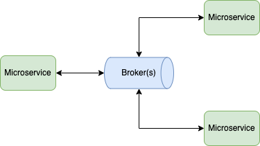

# Microservices
Microservice are a type of architecture (opposite to monolithic) where the application is structured as
a set of services that are in communication in between each other.



In Peque.ts, Microservices are applications that doesn't run via HTTP, and at this moment the available transports are:
- MQTT
- Redis Pub/Sub

The roadmap of transports to be supported is the following:
- Apache Kafka
- Custom brokers


Microservices, anyway, are provider classes decorated with the `@Microservice()` decorator that extends the `MicroserviceHandler` class.

```typescript
@Microservice({ broker: 'mqtt://localhost:1883', transport: 'mqtt' })
export class TestMicroservice extends MicroserviceHandler implements OnProviderInit, OnProviderDestroy {
  start(): void {
    // Start logic, if needed.
  }

  onProviderInit(): void {
    console.log('I have been initialized', TestMicroservice.name);
  }

  onProviderDestroy(): void {
    console.log('I have been destroyed', TestMicroservice.name);
  }

  @ConsumeEvent('test_event')
  test(data: EventPayload<any>) {
    console.log(JSON.stringify(data));
    this.produce({
      event: 'test_event_produced',
      data: { timestamp: Date.now(), name: 'Simone Di Cicco' },
      timestamp: Date.now(),
    });
  }

  @ProduceEvent('produce_test_event')
  produceEvent(data: EventPayload<any>) {
    return { your: 'data'}
  }
  
  produceTestNoDecorator() {
    this.produceEvent('produce_test_event', { your: 'data' });
  }
}
```

# Bootstrap

The Microservices will be started by the PequeFactory, like the web-server.

```typescript
import { TestMicroservice } from './microservices/test-microservice';
import { PequeFactory } from 'peque.ts';

async function startUp() {
  await PequeFactory.createMicroservice({ services: [TestMicroservice] }).start();
}

startUp();
```

Hybrid web-server/microservices applications are possible as well.

```typescript
import { PequeFactory } from 'peque.ts';
import { TestMicroservice } from './microservices/test-microservice';
import { TestRedisMicroservice } from './microservices/test-redis-microservice';
import { TestServerGuard } from './modules/guards/test-server.guard';
import { TestRootModule } from './modules/root/test-root.module';

async function startUp() {
  await PequeFactory.createServer({
    rootModule: TestRootModule,
    cors: true,
    swagger: {
      folder: '/doc',
      info: {
        title: 'Test API',
        description: 'Test API description',
        contacts: {
          name: 'Simone Di Cicco',
          email: 'simone.dicicco@gmail.com',
        },
        version: '1.0.0',
      },
      servers: [{ url: 'https://api.test.com/' }],
      tags: [
        {
          name: 'Tag',
          description: 'Description',
        },
      ],
    },
    logger: {
      consoleOutput: true,
      level: 'debug',
      active: true,
      engine: 'true',
    },
    isCpuClustered: false,
    guards: [TestServerGuard],
    showOriginalErrorObject: true,
  }).start();

  await PequeFactory.createMicroservice({ services: [TestMicroservice, TestRedisMicroservice] }).start();
}

startUp();
```


# Events

## Consume

Events can be intercepted via the `@ConsumeEvent()` decorator.
There is no need to specify the transport, as the one specified from at microservice level will be used.

## Produce

Events can be produced by the `@ProduceEvent()` decorator or the `this.produceEvent()` method
(inherited by the MicroserviceHandler). The transport, as for the consume event, is inherited by the microservice configuration.
